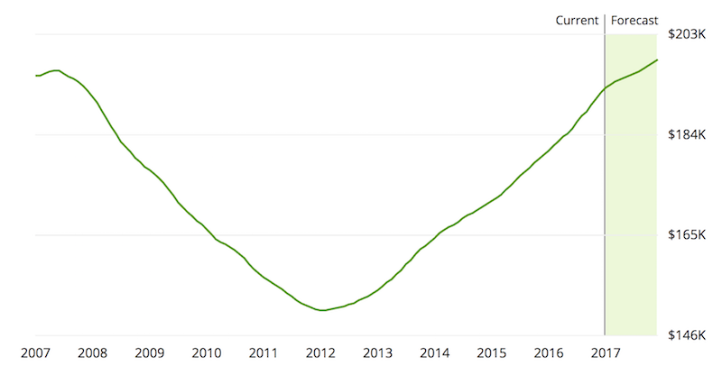

## Welcome to My Coding Portfolio!

Below, you can see the different data science projects I have completed so far. 

### Real Estate Tycoon

.

The aim of this project was to build a model that could accurately predict housing prices based on numerous different features, such as house size, location, and surrounding amenities. Throughout the project, I fitted and plotted numerous different models, comparing each of them to ultimately identify the most accurate model to predict house price. 

Real Estate Tycoon can be found [here](https://github.com/mchhatwal/Real-Estate-Tycoon).

### Markdown

Markdown is a lightweight and easy-to-use syntax for styling your writing. It includes conventions for

```markdown
Syntax highlighted code block

# Header 1
## Header 2
### Header 3

- Bulleted
- List

1. Numbered
2. List

**Bold** and _Italic_ and `Code` text

[Link](url) and 
```

For more details see [GitHub Flavored Markdown](https://guides.github.com/features/mastering-markdown/).

### Jekyll Themes

Your Pages site will use the layout and styles from the Jekyll theme you have selected in your [repository settings](https://github.com/mchhatwal/mchhatwal.github.io/settings). The name of this theme is saved in the Jekyll `_config.yml` configuration file.

### Support or Contact

Having trouble with Pages? Check out our [documentation](https://help.github.com/categories/github-pages-basics/) or [contact support](https://github.com/contact) and we’ll help you sort it out.
