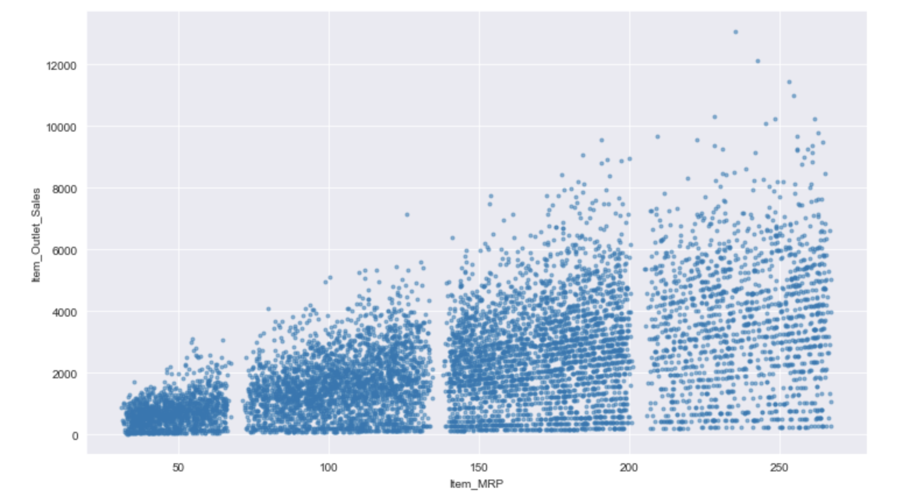
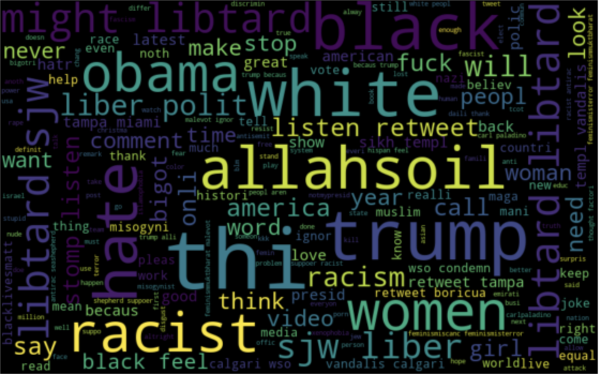

## Welcome to My Coding Portfolio!

Below, you can see the different machine learning projects I have completed so far. 

### Real Estate Tycoon

.

The aim of this project was to build a model that could accurately predict housing prices based on numerous different features, such as house size, location, and surrounding amenities. Throughout the project, I fitted and plotted numerous different models, comparing each of them to ultimately identify the most accurate model to predict house price. 

Real Estate Tycoon can be found [here](https://github.com/mchhatwal/Real-Estate-Tycoon).

### Chief People Officer 

.  

The aim of this project was to build and analyze models predicting which employees were most likely to leave a company. The numerous features in my dataset included numerous employee satisfaction metrics, which allowed my model to best predict employees most likely to leave. Furthermore, my model would predict the future probability of employees leaving, allowing the company's HR department better ensure they can reach such employees before they leave the company. 

Chief People Officer can be found [here](https://github.com/mchhatwal/Chief-People-Officer).

### BigMart Sales 
  

In the BigMart sales project, my goal was to build a machine learning model to predict the sales of each product across different stores. My model based its prediction on past sales data from each store, then made predictions on how much each store would need of each item. This assists the outlets in properly stocking and storing inventory in their store, ultimately boosting profits! 

BigMart Sales can be found [here](https://github.com/mchhatwal/BigMart-Sales).

### Twitter Sentiment Analysis 

.

Now a days, our country is becoming more and more polarized with political opinions, radical actions, and hate speech. With the prominence of social media, hate speech is surging across numerous platforms, one being Twitter. Being able to classify tweets as either hate speech or not is crucial in today's climate, and luckily, I have build a machine learning model to accomplish exactly this task! Using a dataset of previous tweets and natural language processing, my ML model will label tweets as '0' for regular speech and '1' for hate speech! 

Twitter Sentiment Analysis can be found [here](https://github.com/mchhatwal/Twitter-Sentiment-Analysis).
