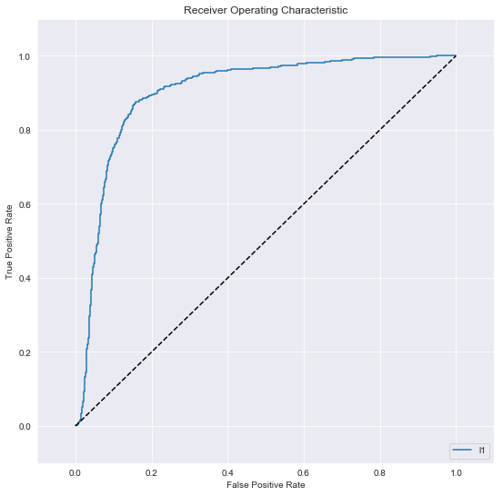

## Welcome to My Coding Portfolio!

Below, you can see the different machine learning projects I have completed so far. 

### Real Estate Tycoon

.

The aim of this project was to build a model that could accurately predict housing prices based on numerous different features, such as house size, location, and surrounding amenities. Throughout the project, I fitted and plotted numerous different models, comparing each of them to ultimately identify the most accurate model to predict house price. 

Real Estate Tycoon can be found [here](https://github.com/mchhatwal/Real-Estate-Tycoon).

### Chief People Officer 

.  

The aim of this project was to build and analyze models predicting which employees were most likely to leave a company. The numerous features in my dataset included numerous employee satisfaction metrics, which allowed my model to best predict employees most likely to leave. Furthermore, my model would predict the future probability of employees leaving, allowing the company's HR department better ensure they can reach such employees before they leave the company. 

Chief People Officer can be found [here](https://github.com/mchhatwal/Chief-People-Officer).

### BigMart Sales 
  
!

### Unsupervised Customers 

### Twitter Sentiment Analysis 
